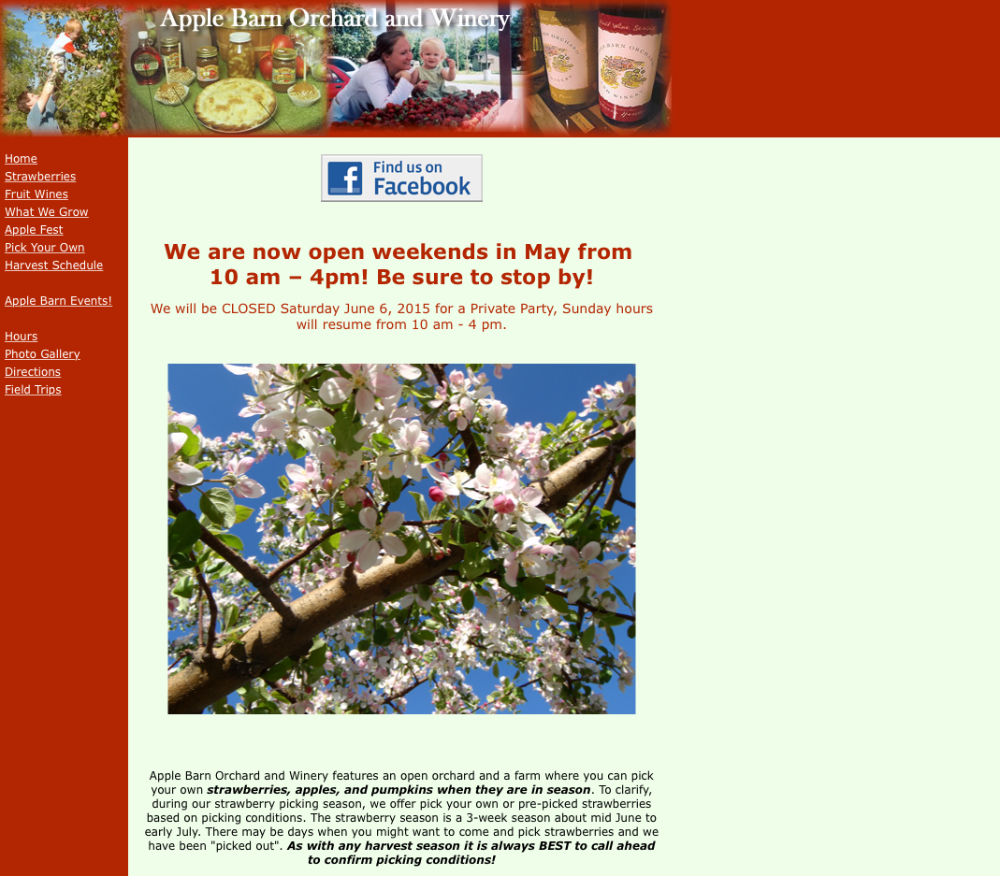
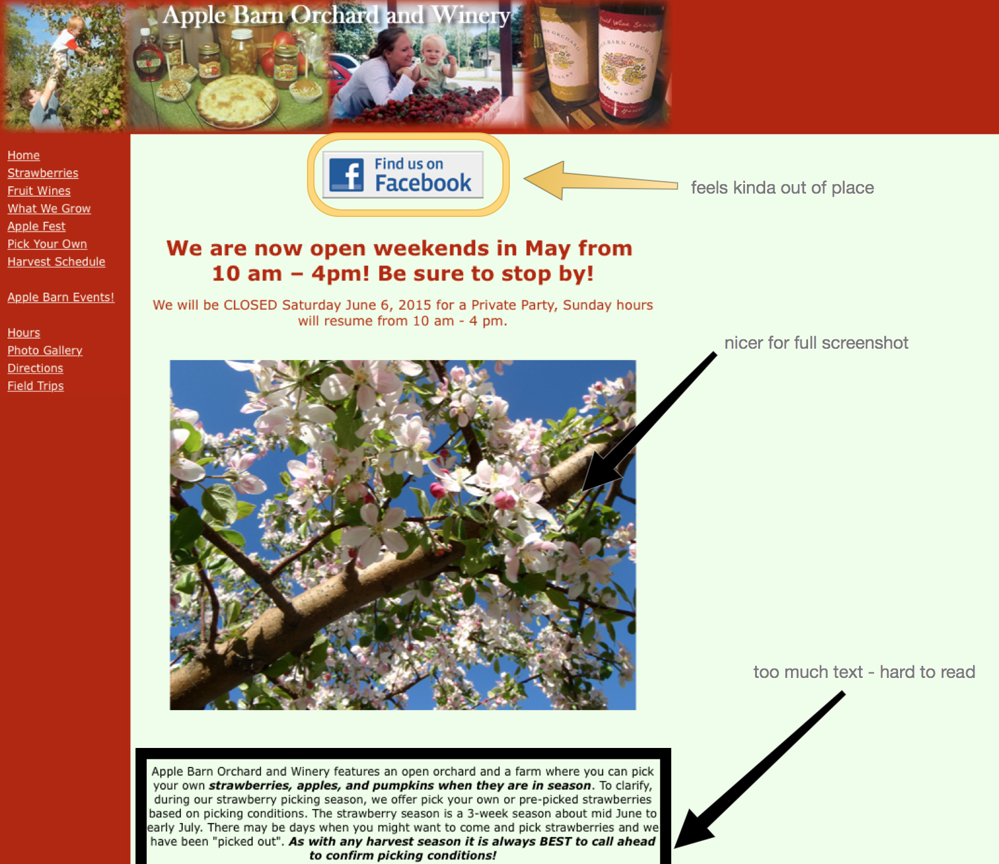
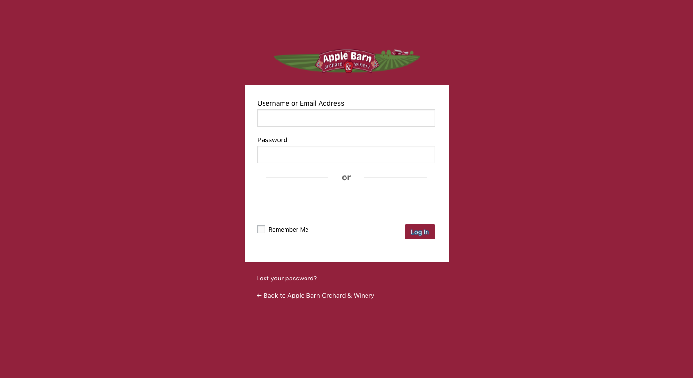

## Overview

Apple Barn is a family owned farm located in Elkhorn, Wisconsin. They specialize in fresh Strawberries, Pumpkins and many different varieties of apples. Families can come to the farm and expect a fun experience of picking up the freshest fruit.

## The Project

The team came to me, through a mutual friend, and wanted me to refresh their current website. The old website was build in static markup and outdated. The final project had to be in Wordpress and use a pre-built theme due to a quick deadline.

## Research

Working with the team, I built a competitive analysis. This document compares their website with four of their closest competitors. I used certain pages of each competitor and commentated it with my suggestions or notes.  Finally, I used to find the companies strengths and weaknesses and used this to help find a theme.

## Selection

I took the analysis above to find a selection of pre-built themes. Looking throughout a variety of themes, I found six that I sent to the team for selection. The team came back with the [Non-Profit theme](https://organicthemes.com/theme/non-profit-theme/) as there base, which we bought and started using.

## Design and Development

After installing the theme, I provided many other tasks to the team, including:

* A custom login page
* Custom PHP and CSS overrides
* Region management

### Custom Login

As an extension of the Apple Barn brand, it was important the back end felt as part of the Apple Barn website as well. For this, I created different branding cues for the back end, including a custom themed login page. This simple page is like Wordpress but includes the teams color scheme and logo. This was important to keep a visual identity throughout and help newer members feel part of the team.

### Custom PHP and CSS overrides

Using my extensive knowledge of PHP and CSS I was able to assist the team in further customizing the web page. Some of the tasks included:

* Changing widths and heights of certain items.
* Simplifying certain Wordpress properties and elements.
* Added new custom elements to the website.

### Region Management

The main strength of Wordpress for the team is its the ease of content flow and use. To help with this I worked with the team in creating new sections of the webpage were content could get added. This was helpful as it allowed the team to edit and maintain a stream of content as their seasons changed.

## Wrap Up and Deploying

After receiving the final okay, I worked with the team in deploying the website. I then created documentation and videos to help the team use their new website.
