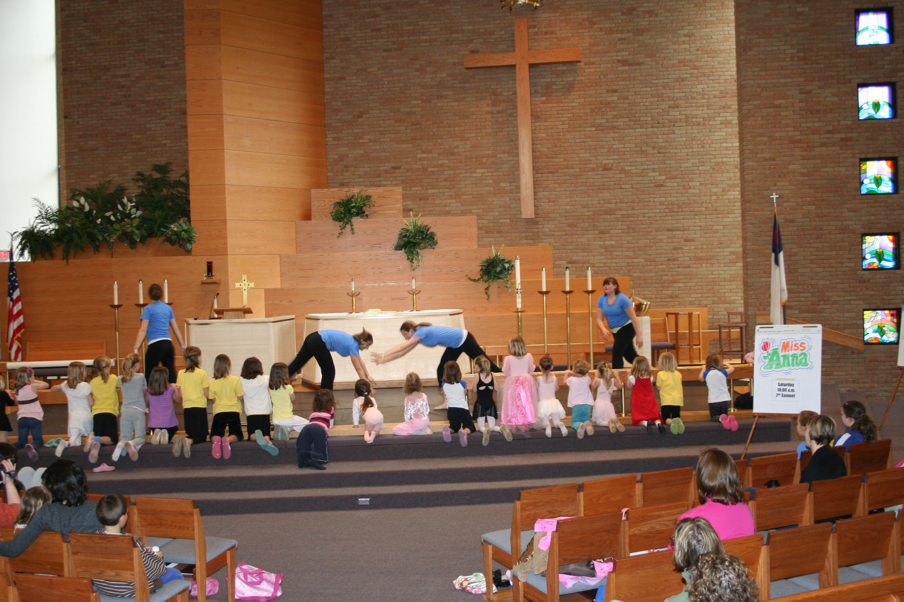
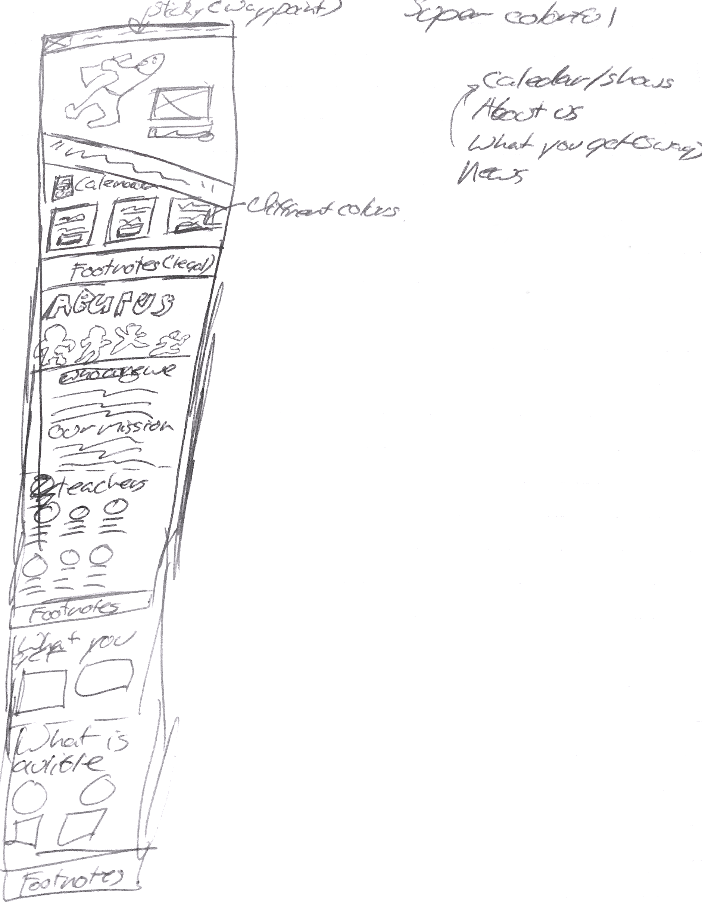

## Overview

Spirited Feet is a dancing organization based in Woodbury, Minnesota. Their mission is to teach dance and Christ in a non-competitive dance environment. They teach dance and choreography to grades 3 through 12 and offered many nights a week.



## Goals and Project

They came to me through a mutual referral to help update their outdated website. They were not happy with the current website and wanted something modern to replace it with. The client preferred that it would remain in Wordpress and be well modifiable.

## Design Process

Being both designer and developer on this project, I was able to control the look and feel of the website. Having a family member who teaches grade school and a history of working with children. Because of this, I was able to get a head start on the normal research process by using my own experence, and ideas gathered by others.



I worked through a few different concepts, finally landing on a unique one sided design. This design, after mocking it up for the client, got the green light and the go-ahead for development work.

## Development

I have several years of experience in Wordpress so creating a new theme in WordPress was not hard. I used Underscores as a starter theme and added custom styling and code to the theme.

Some key development points that I ran into were:

* Setting up a single page website for many WordPress pages.
* Creating a fixed navigation menu.
* Using Themify Builder as a content editor.

### Single Page

The first challenge was creating a one-page cohesive webpage. There were a few different approaches for this, I finally decided on the many to one solution though.

This worked by creating every section as its own Wordpress page. This had many benefits including cleaner organization and better references. After going through and creating all the pages one by one. I was able to use a custom WordPress loop that finds the pages and concatenate them into one page.


### Fixed Navigation

The next challenge that awaited me was creating a menu that followed the user down the page. This menu had two different states depending on which part of the page the user was on.

Using the Waypoints library, I was able to use a landmark on the website to trigger an element change. This happens when the user scroll past the header, a second state would happen. This second state would follow the user down the rest of the page until they scrolled back to the header.

One problem is that the Themify Builder would not corporate well with the jQuery I was using for this effect. To fix this effect I used Waypoints with generic javascript to build the effect in a non-conflicting way.

```js
    var waypoint = new Waypoint({
	    element: document.getElementsByClassName('about'),
			handler: function(direction) {
			var scrollNav =  document.getElementById('scrollNav');
			if(direction === 'down'){
				scrollNav.setAttribute('class', 'scroll-is-shown');
			}
			if(direction === 'up'){
				scrollNav.setAttribute('class', 'scrollnav');
			}
		    },
			    offset: '5%'
		})
```

### Themify Builder

Themeify Builder was the last part I needed to add to the website. The builder installed via a paid plugin and created a front-end editor for the client. From this editor, the client could create or edit any content via blocks and containers. This alleviated the complex knowledge of how Wordpress works.

## Deployment and Wrap up

After the final development, I assisted in deploying the website to their servers. After that, I helped the client in creating several videos in how to maintain and use the new website.
