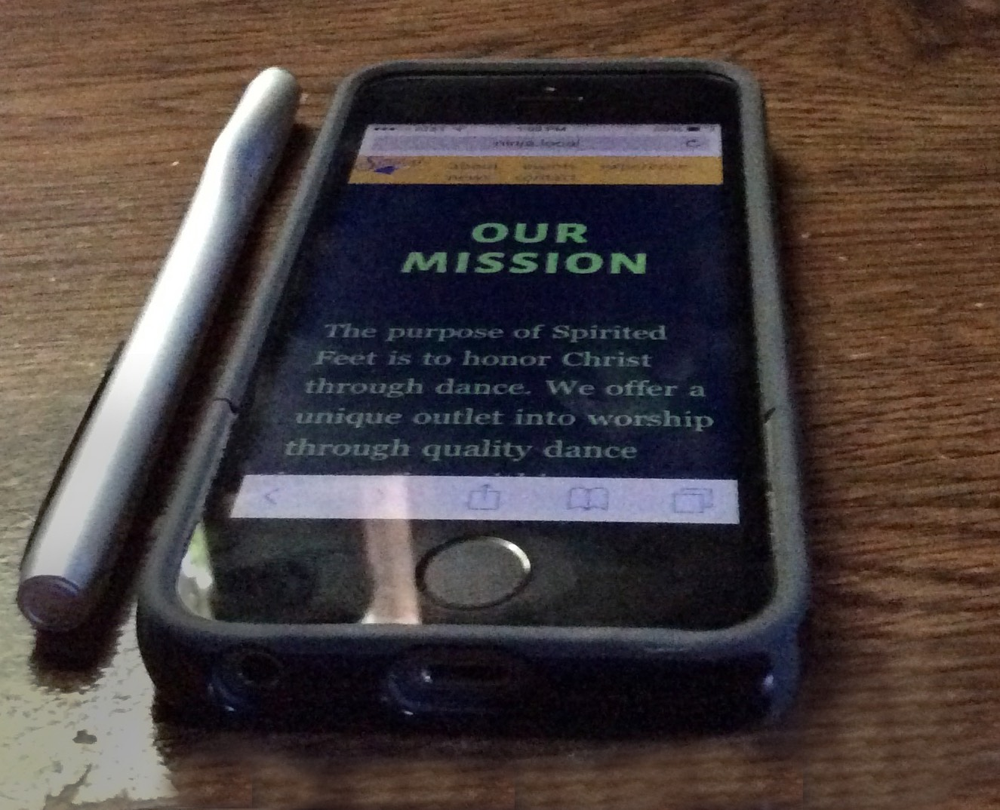

### The Challenge

Spirited Feet is a Christian dance company based in Woodbury, Minnesota. I was approached by them with the challenge of redesigning their old website using WordPress as the management system. After doing some research on the business and their competitors, I decided the best path to take would be to create a new design from the ground up.

### The Solution

Starting with  [Underscores](http://underscores.me/) a basic, plain, starter theme from [Automattic](https://automattic.com/), I started to draw and code a fresh new experience, utilizing bright colors, and unique layout which changes as you scroll down the page.

To make this experience I started in understanding the problem with the website, noting what works and what could be improved. From here I worked with the client through a mentor, on sketching and mocking up a few solutions to how we could solve this problem through the use of a unique interface and custom development.

Finally, in development, using underscores, I created a multipart, single page template in WordPress and used the great [Themify Builder](https://themify.me/builder) create template regions in which the client could easily modify and create new content using a front-end user interface. After the website was finished, I helped the client in deployment and any follow-up guidance that was needed to use the website.

